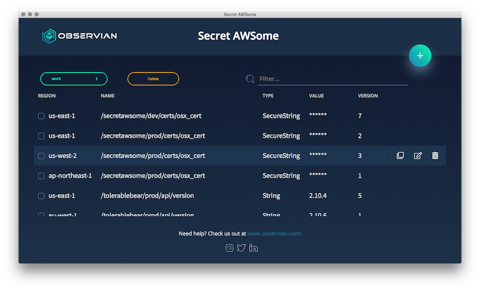
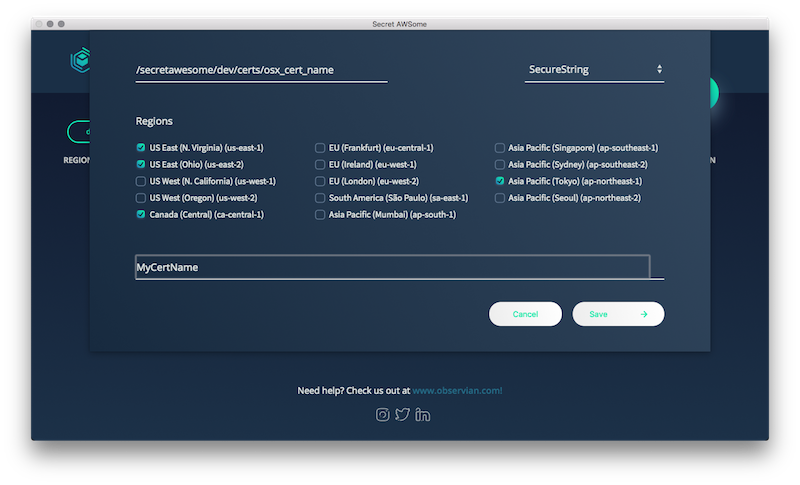
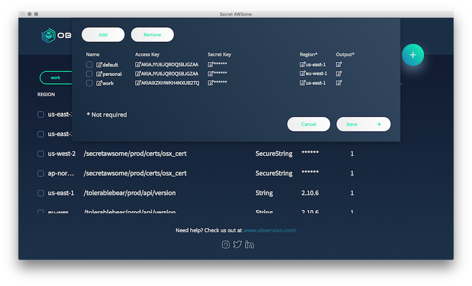

# Secret AWSome

Easily manage AWS Systems Manager Parameter Store items across regions

## Main View

## Add or Clone a Parameter to Multiple Regions

## Manage Multiple Profiles

Reads/Writes to your local AWS `credentials` file. More information on the local configuration and credential files can be found [here.](https://docs.aws.amazon.com/cli/latest/userguide/cli-config-files.html)

